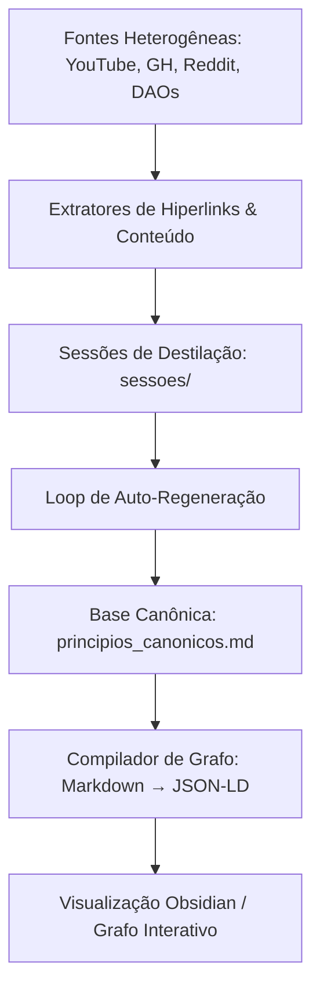

# 🌐 Integração Holística de Fontes & PKM (Personal Knowledge Management)
### Relevance Operating System · Arquitetura de Conectores e Consolidação em Grafo

Este documento apresenta a especificação técnica para integrar fontes heterogêneas de dados no ecossistema do **Promptcraft**, detalhando caminhos de autenticação, acessibilidade de API, ferramentas locais e a consolidação do conhecimento em um grafo relacional (PKM).

---

## 🗺️ 1. Mapeamento das Fontes e Protocolos de Acesso

### 📺 1.1 YouTube (Diferença de Contas)
* **Status**: Playlists de interesse estão em `joaonit@gmail.com` e a conta PRO do agy é `xinaia`.
* **Solução Técnica**: 
  * **Playlists Públicas/Não Listadas**: Podem ser acessadas sem qualquer autenticação diretamente pelo ID da playlist via scrapers ou APIs públicas.
  * **Playlists Privadas**: A única forma de acessá-las sem alterar chaves de login no CLI é exportando a playlist como arquivo CSV pelo Google Takeout da conta correspondente e salvando em `/takeout/`.
  * **Transcrição de Vídeos**: Graças ao coletor local integrado (`youtube-transcript-api`), qualquer vídeo público ou não listado das playlists terá seu áudio-texto recuperado sem dependência de login ou tokens de API.

### 💬 1.2 Reddit (PRAW vs. Takeout)
* **Solução Técnica**: O CLI suportará as duas vias:
  * **Via API (PRAW)**: Pode ser configurado fornecendo `client_id`, `client_secret` e `user_agent` no `.env`. O script usará PRAW para ler de forma contínua os posts favoritados (`reddit.user.me().saved()`).
  * **Via Arquivo de Ingestão (Takeout)**: Para usuários sem API keys, o parsing do arquivo JSON de posts salvos (padrão de exportação do Reddit) é mantido como o fallback de alta fidelidade do subcomando `importar --type reddit`.

### 💻 1.3 GitHub Starred (Autenticação do Sistema)
* **Solução Técnica**: Como o comando `gh` já está instalado e autenticado localmente, o CLI do Promptcraft pode delegar requisições diretamente para a ferramenta nativa de forma limpa:
  ```python
  import subprocess
  def fetch_github_starred_cli():
      res = subprocess.run(["gh", "api", "user/starred"], capture_output=True, text=True)
      return json.loads(res.stdout)
  ```
  Isso elimina a necessidade de armazenar tokens adicionais no `config.json`.

### 📓 1.4 NotebookLM
* **Limitação**: O NotebookLM do Google é um ecossistema fechado sem API ou interface de linha de comando pública.
* **Alternativa de Ingestão**:
  * Exportar o caderno consolidado via **Google Docs/Drive** ou através do **Google One (Takeout)**.
  * O material exportado em Markdown ou PDF deve ser salvo na pasta `/takeout/` e indexado como documentação pelo pipeline principal do CLI.

### 📂 1.5 Google Drive (Integração com rclone)
* **Solução Técnica**: O `rclone` (que já possui os tokens configurados) será incorporado via subcomando semi-automatizado no CLI:
  ```bash
  python3 promptcraft.py importar --type gdrive --remote "sua_conta_rclone:caminho/pasta"
  ```
  Internamente, o script executará `rclone sync` para baixar novos PDFs, notas e transcrições diretamente para `/takeout/` antes de rodar a triagem e o processamento de conhecimento.

### 🌐 1.6 Web Links (Bookmarks de Navegadores)
* **Solução Técnica**: O Promptcraft pode ler diretamente os arquivos de favoritos locais do navegador caso estejam no mesmo filesystem:
  * **Chrome/Chromium**: `/home/sukata/.config/google-chrome/Default/Bookmarks`
  * **Firefox**: Varredura SQLite do arquivo `places.sqlite` no perfil do usuário.
  * O CLI lerá o arquivo JSON de Bookmarks do Chrome e extrairá todas as URLs organizadas por diretórios originais, automatizando a importação sem exigir a exportação de HTML manual.

### 📚 1.7 Artigos Científicos e Adjacências (Semantic Scholar)
* **Solução Técnica**: Em vez do Google Scholar (que bloqueia bots rapidamente com CAPTCHAs), utilizaremos a API do **Semantic Scholar** (`api.semanticscholar.org`).
  * Para cada paper do arXiv ingerido, o CLI consulta o endpoint `/paper/arXiv:{id}` para recuperar o resumo, referências e citações.
  * Para encontrar artigos semanticamente adjacentes, consultamos o endpoint `/recommendations/papers` fornecendo os IDs dos papers atuais como semente (seed). Os artigos adjacentes mais citados são sugeridos em `lacunas_abertas.md`.

### 💬 1.8 Chatlogs de GPTs (Chrome DevTools Protocol - CDP)
* **Solução Técnica**: Para extrair chatlogs sem API, utilizaremos o CDP (Chrome DevTools Protocol) conectando a uma instância rodando com a sessão do usuário logada.
  * O script automatizado executa uma varredura DOM via Puppeteer/Playwright headless usando os cookies ativos da sessão autenticada para extrair o HTML ou JSON de conversas e salvar em `/sessoes/`.

### 🌐 1.9 Raspagem de SPA (Lightpanda / Headless Chrome)
* **Solução Técnica**: Para sites complexos com client-side rendering (SPA), o CLI utilizará o **Lightpanda** (navegador headless ultrarápido escrito em Go) ou Playwright para pré-renderizar a página antes da extração de links pela classe `HTMLTextExtractor`.

### 🗳️ 1.10 Dados Web3 (DAOs & On-chain)
* **Solução Técnica**:
  * ** Snapshot (DAOs)**: Consultar o endpoint GraphQL público do Snapshot (`hub.snapshot.org/graphql`) para puxar propostas e votos de projetos configurados.
  * **Métricas On-chain**: Integração com APIs públicas de subgraphs da **The Graph** para capturar métricas de liquidez, volume e TVL estruturados como constantes ontológicas.

---

## 🕸️ 2. Consolidação da Base em um Grafo de Conhecimento (PKM)

Para transformar a base de Markdown estruturada em um Grafo de Conhecimento Relacional (Personal Knowledge Management - PKM), adotaremos o seguinte fluxo:



### 🔗 2.1 Hiperlinks entre Axiomas (Arcos Nexialistas)
Todos os axiomas em `principios_canonicos.md` devem se referenciar mutuamente usando wikilinks padrão ou markdown links. Exemplo:
> "O acoplamento rígido gera riscos estruturais, conforme discutido no [[Isomorfismo de Auto-referência Recursiva]] e mitiga-se com clean architecture."

### 📂 2.2 Geração Automática do Grafo de Conhecimento
Criaremos um script compilador em Python (`compile_graph.py`) no CLI que lê a pasta `ontologia/`, resolve as dependências descritas no frontmatter YAML (`referencias`) e nos links internos, exportando um arquivo JSON relacional (nós e arestas) compatível com ferramentas de PKM (como Obsidian, Logseq ou visualizadores interativos em D3.js).

---

## 🧼 3. Deduplicação, Higienização e Mitigação de Latência

### 🪞 3.1 Estratégia de Deduplicação de Arquivos Heterogêneos (NotebookLM)
* **Problema**: Arquivos exportados do NotebookLM (áudios, vídeos, PDFs, metadados) estão distribuídos em 4 drives, contendo variações de nomes e tamanhos ligeiramente diferentes. Verificação de hash binária (MD5) pura falha nestes cenários.
* **Solução Técnica**:
  * Utilizar **Similaridade de Cosseno** baseada em vetores de TF-IDF ou embeddings do conteúdo textual extraído das transcrições e PDFs.
  * Estabelecer um limiar de **92% de similaridade semântica** para agrupar e rotular arquivos duplicados.
  * Manter na base unificada (Drive `xinaya` com limite de 15GB) apenas a versão mais recente ou mais rica em termos de metadados, arquivando as demais versões redundantes.

### 🖼️ 3.2 Higienização de Infográficos e Imagens (`unamed(x).png`)
* **Problema**: Infográficos úteis são frequentemente salvos com nomes genéricos como `unamed(1).png`, que degradam a qualidade da busca semântica e a organização do grafo de conhecimento.
* **Solução Técnica**:
  * Implementar um pipeline de OCR local (ex: via `tesseract-ocr` ou modelos leves de visão) integrado na triagem de mídias.
  * O OCR extrai os termos-chave mais relevantes da imagem e os tópicos presentes no infográfico.
  * O arquivo é renomeado dinamicamente seguindo o padrão canonizado: `infografico_<topicos_chave_extraidos_ocr>.png`, com o texto OCR anexado no frontmatter Markdown que representa a imagem na ontologia.

### ⚡ 3.3 Mitigação de Latência em Acessos Remotos (Rclone RAG)
* **Problema**: Executar buscas remotas e RAG diretamente nas pastas montadas do Google Drive (rclone) introduz latência severa incompatível com a velocidade exigida pelo CLI.
* **Solução Técnica**:
  * **Sincronização Incremental com Local Cache**: O banco de dados local SQLite (`/home/sukata/chatlogs/cache_processamento.db`) atuará como o cache de alta performance.
  * O pipeline calculará hashes MD5 dos arquivos no Drive via metadados rápidos fornecidos pelo rclone. Apenas os arquivos com hash diferente ou novos arquivos serão puxados fisicamente para o diretório `/takeout/` local.
  * O RAG fará consultas no cache local SQLite em vez de consultar a nuvem, reduzindo a latência a milissegundos e permitindo operações rápidas no CLI.

