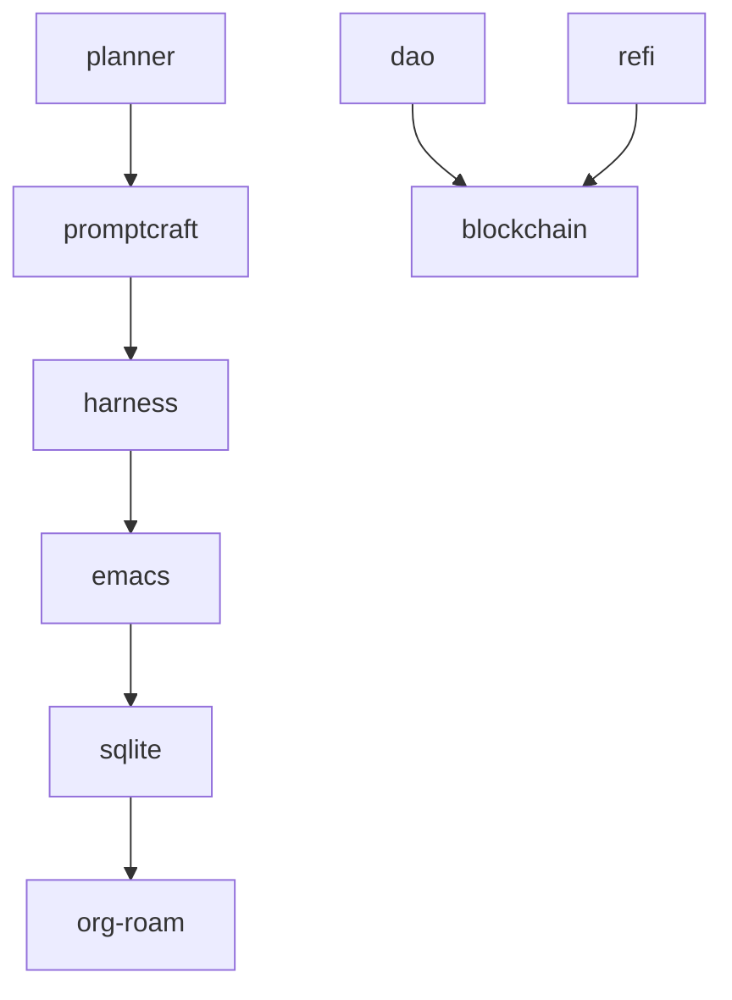

# 🔬 Laboratório de Linguística Cognitiva Aplicada — Análise do Corpus Planner

Este relatório consolida a análise psiolinguística, semântica e topológica executada sobre o corpus de Engenharia Cognitiva do **Planner** (`shared-knowledge`), unindo a coleta do Promptcraft com a operacionalização do Planner.

---

## 🌱 Camada 1 — Linguística de Corpus Clássica

### 🔠 TF-IDF / Frequência Conceitual
As palavras mais recorrentes do corpus refletem o direcionamento ontológico e técnico do ecossistema:
  - **the**: 55773.46
  - **sukata**: 55687.76
  - **emacs**: 51459.29
  - **https**: 42880.32
  - **home**: 34131.96
  - **yes**: 29250.63
  - **self**: 25136.98
  - **use-package**: 23733.52
  - **and**: 21777.82
  - **org**: 21754.28
  - **let**: 21563.86
  - **json**: 21516.70
  - **lakehouse**: 21417.98
  - **www**: 20446.61
  - **lisp**: 20236.83
  - **input**: 19482.12
  - **content**: 18795.30
  - **setq**: 18487.95
  - **output**: 18358.94
  - **for**: 18031.07
  - **tool**: 17557.92
  - **init**: 17386.59
  - **file**: 17203.42
  - **tests**: 17173.04
  - **ensure**: 16262.92

### 🧬 Famílias Morfológicas Produtivas
As principais famílias de prefixos detectadas nos mostram a estruturação morfológica própria do dialeto Compilatorum:
- **meta-**: metadata (1135), metadados (330), metacrítica (292), meta-análise (152), metacríticas (120)
- **onto-**: ontologia (1079), ontology (869), ontológica (359), ontológico (290), onto_feedback (138)
- **neuro-**: neurocoder (2790), neurocoder-full-config (389), neurocoder-load-modules (96), neurocoder-config (75), neurocoder_upgrade_plan (74)
- **crypto-**: cryptography (14), cryptodose (12), cryptocurrency (10), cryptopolitan (10), cryptojobslist (8)
- **graph-**: graphql (444), graphiphy (240), graphs (186), graph-rag (152), graphrag (145)
- **vibe-**: vibe_coding (45), vibe-coding-rag (44), vibe-term (32), vibes (25), vibecodinginstruction (14)
- **agent-**: agents (911), agente (855), agentes (749), agentic (517), agent-shell (491)

### 📚 Glossário de Conceitos Vivos (Citações Diretas)
Exemplos reais de frases encontradas no corpus contendo termos canônicos:
- **corpo_simbolico**:
  * br/correio/edicao/253/corpo_real_corpo_simbolico_corpo_imaginario/295 | Corpo real, corpo simbólico, corpo imaginário - Correio APPOA
- **corpo_simbólico**:
  * pglt=299&q=corpo+simb%C3%B3lico&cvid=c1d7b41bd4884e7d957bed81195c91ec&gs_lcrp=EgRlZGdlKgYIABBFGDkyBggAEEUYOTIGCAEQABhAMgYIAhAAGEDSAQg0MjQwajBqMagCALACAA&FORM=ANNTA1&PC=U531 | corpo simbólico - Pesquisar
  * br/correio/edicao/253/corpo_real_corpo_simbolico_corpo_imaginario/295 | Corpo real, corpo simbólico, corpo imaginário - Correio APPOA
- **engenhoca_simbolica**:
  * Nenhuma citação direta no corpus
- **engenhoca_simbólica**:
  * Nenhuma citação direta no corpus
- **vibe_engineering**:
  * Nenhuma citação direta no corpus
- **capital_regenerativo**:
  * Nenhuma citação direta no corpus
- **oracle**:
  * Oracle Cloud (OCI Always Free ARM)
  * *   **Como contornar o Sleep**: Criar um cron job ou script na Oracle Cloud ou Termux que envia uma requisição HTTP simples (`ping`) para a URL do Space a cada 24 horas, mantendo a API do MoLoRA sempre ativa e acordada
- **oráculo**:
  * com/notebook/1183f819-4b41-41cb-822c-c8c987e47eeb | Oráculo: Avaliação de Dados Sintéticos ELI5 - NotebookLM
  * v=KD4-x_99zD4 | Para pensar uma algorética | Oráculos: entre ética e governança dos algoritmos - Paolo Benanti - YouTube
- **planner**:
  * 📁 /projects: Organizar as subpastas como manus, client, server e context-planner
  * primeiro gere um arquivo markdown como planner, em outline com emojis, incluido essas sugestoes, visando uma organização sistemica
- **promptcraft**:
  * *   **Promptcraft Impreciso**: Prompts anteriores pediam "resumos"
  * *   **Promptcraft para Arqueologia**:

---

## 🎭 Camada 2 — Psicolinguística & Modalização

### 📊 Análise de Sentimento Baseada em Aspectos (ABSA)
Valência associada a cada conceito chave dentro das discussões e playbooks do Planner:

| Aspecto | Valência Detectada |
| :--- | :--- |
| ARQUITETURA | Positive: 48, Negative: 15, Neutral: 2078 |
| DOCUMENTACAO | Positive: 50, Negative: 2, Neutral: 1979 |
| EXECUCAO | Positive: 0, Negative: 0, Neutral: 4 |
| DAO | Positive: 9, Negative: 0, Neutral: 1297 |

### 🧭 Modalização (Visão vs. Implementação)
Frequência de verbos de obrigação/desejo/possibilidade que mostram a relação entre o conceitual idealizado e o real executado:
- **DEVE** (Obrigação/Visão): 1167
- **DEVERIA** (Idealização): 91
- **PRECISA** (Necessidade Técnica): 789
- **PODE** (Capabilidade): 1818
- **PODERIA** (Hipótese): 95
- **TALVEZ** (Incerteza/Latência): 271

---

## 🕸️ Camada 3 — Grafo de Conhecimento Semântico ($G=(V,E)$)

Relações de adjacência e co-ocorrência dos nós de conhecimento nos parágrafos do Planner:
- **EMACS** $\leftrightarrow$ **RAG** (Frequência de co-ocorrência: 916)
- **EMACS** $\leftrightarrow$ **ORG-ROAM** (Frequência de co-ocorrência: 525)
- **ORG-ROAM** $\leftrightarrow$ **RAG** (Frequência de co-ocorrência: 288)
- **LORA** $\leftrightarrow$ **RAG** (Frequência de co-ocorrência: 276)
- **EMACS** $\leftrightarrow$ **ONTOLOGIA** (Frequência de co-ocorrência: 243)
- **ONTOLOGIA** $\leftrightarrow$ **RAG** (Frequência de co-ocorrência: 191)
- **EMACS** $\leftrightarrow$ **LORA** (Frequência de co-ocorrência: 186)
- **EMACS** $\leftrightarrow$ **HARNESS** (Frequência de co-ocorrência: 133)
- **EMACS** $\leftrightarrow$ **PLANNER** (Frequência de co-ocorrência: 97)
- **HARNESS** $\leftrightarrow$ **RAG** (Frequência de co-ocorrência: 90)
- **LORA** $\leftrightarrow$ **ORG-ROAM** (Frequência de co-ocorrência: 79)
- **ONTOLOGIA** $\leftrightarrow$ **ORG-ROAM** (Frequência de co-ocorrência: 75)
- **PLANNER** $\leftrightarrow$ **RAG** (Frequência de co-ocorrência: 67)
- **ORG-ROAM** $\leftrightarrow$ **SQLITE** (Frequência de co-ocorrência: 63)
- **LORA** $\leftrightarrow$ **ONTOLOGIA** (Frequência de co-ocorrência: 60)

---

## 🏛️ Camada 4 — Dataset de Fine-Tuning SLM (LoRA)

Extraímos e estruturamos **4 pares de instrução/resposta** a partir da desconstrução conceitual dos arquivos do Planner.
*   **Destino do Dataset**: [dataset_planner_slm.jsonl](file:///home/sukata/promptcraft/ontologia/dataset_planner_slm.jsonl)
*   **Objetivo**: Treinar um modelo local (SLM) usando adaptadores LoRA (Unsloth) para que ele assimile o dialeto linguístico, a lógica interdisciplinar e a capacidade de planejamento sistêmico do ecossistema Compilatorum.

---
*Relatório gerado pelo Laboratório de Linguística Cognitiva Aplicada.*
