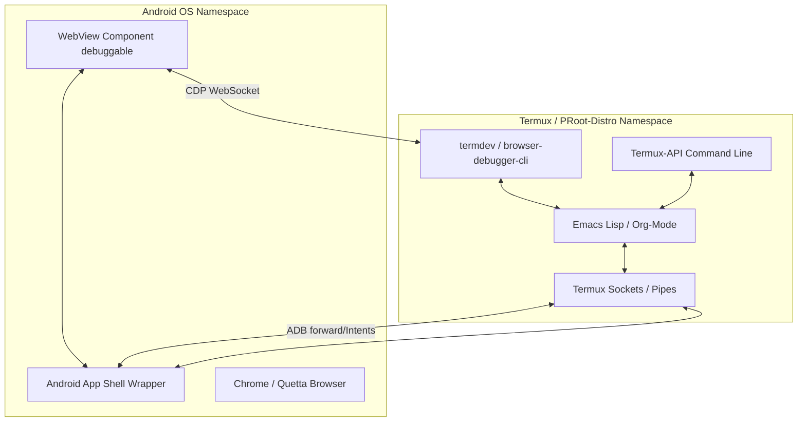

# Especificação Técnica: Compilatorum Offline IDE & App Shell (Android)

Este documento especifica a arquitetura de integração do ecossistema **Compilatorum / Promptcraft** em ambiente móvel Android (utilizando **Termux-API, Termux-GUI, Emacs e WebViews**). O objetivo é criar uma IDE de Soberania Local, offline por design, permitindo edição de código, automação de tarefas e ingestão semântica de chats dinâmicos.

---

## 🏗️ 1. Arquitetura e Matriz de Ferramentas

O sistema é construído sobre uma divisão clara de responsabilidades entre interface visual, lógica de edição de texto, comunicação com o sistema operacional e renderização web.



### 1.1 Matriz de Responsabilidades

| Componente | Função Principal | Mecanismo de Entrada/Saída |
| :--- | :--- | :--- |
| **Emacs (Lisp / Org-Mode)** | Orquestrador lógico, escrita e edição de notas. | Sockets de rede local, subprocessos em background, Pipes Unix. |
| **Android WebView** | Motor visual, renderizador de SPAs (chats) e runtimes HTML. | `evaluateJavascript`, interfaces Java/JS, DevTools Protocol (Porta 9222). |
| **Termux-API** | Ponte de controle de hardware do dispositivo Android. | CLI (Clipboard, notificações, envio de intents, storage). |
| **Termux-GUI** | Criação de layouts nativos e diálogos gráficos no terminal. | Protocolo de socket Unix do plugin GUI. |

---

## ⚡ 2. Especificação por Camada Operacional

### 2.1 Interação (Como as ferramentas conversam)
O tráfego de dados entre o editor (Emacs) e o motor de exibição (WebView/Navegador) ocorre de forma assíncrona bidirecional:
*   **Emacs para WebView (Download/Scroll):** O Emacs emite um sinal via WebSocket ou dispara um subprocesso que executa comandos do Chrome DevTools Protocol (CDP).
*   **WebView para Emacs (Ingestão/Markdown):** O WebView processa a página localmente, compila o HTML para Markdown e joga na área de transferência compartilhada. O Emacs lê a área de transferência via Termux-API (`termux-clipboard-get`) e carrega o arquivo no buffer ativo.

### 2.2 Automação (Sem Playwright/Crawl4AI)
Substituímos runtimes pesados (Node/Python headless) por um mecanismo enxuto baseado em pipes e sockets do CDP nativo:
1.  O Emacs Lisp (ou a CLI `browser-debugger-cli`) conecta-se à porta de debug remoto do Chromium.
2.  Para tarefas interativas rápidas, a TUI `termdev` é acoplada na porta de debug para inspecionar requisições HTTP e erros de script diretamente da linha de comando, sem abrir a interface de desenvolvedor no celular.

### 2.3 Autenticação (Aproveitando a Sessão Ativa)
Em vez de implementar fluxos de login em scripts headless (que falham devido a CAPTCHAs e WAFs), o sistema delega a autoridade. 
*   Você faz o login no navegador normal do Android (Chrome, Quetta) ou no WebView do seu próprio App Shell.
*   Os cookies e a sessão ativa de navegação ficam salvos no perfil local do navegador móvel.
*   A automação do CDP simplesmente anexa sua conexão ao navegador ativo, herdando instantaneamente a sessão autenticada.

### 2.4 Renderização e Estilização
*   O **WebView** renderiza mockups visuais e dashboards em HTML5, usando Tailwind pré-compilado (ou CSS Vanilla) armazenados localmente no repositório.
*   O **Cytoscape.js** e grafos do Promptcraft são expostos como páginas web locais hospedadas em servidores locais minimalistas e exibidos no WebView do app, enquanto você edita e manipula o grafo via buffers de texto do Emacs.

---

## 🔌 3. Resolução de Dependências Críticas

Esta seção especifica se e quando ferramentas externas como Python, ADB e Bookmarklets são obrigatórias na arquitetura Compilatorum.

```
                  ┌──────────────────────────────┐
                  │   Qual é o canal de ingestão  │
                  │        desejado?             │
                  └──────────────┬───────────────┘
                                 │
                 ┌───────────────┴───────────────┐
                 ▼                               ▼
       [ Automação via CDP ]            [ Bookmarklet Loader ]
                 │                               │
       ┌─────────┴─────────┐                     ▼
       ▼                   ▼               * SEM PYTHON *
 [ Pelo Termux ]    [ Pelo App Shell ]     * SEM ADB *
       │             (WebView Nativo)      * SEM PLAYWRIGHT *
       ▼                   │
 * EXIGE ADB *             ▼
 * EXIGE PYTHON *    * SEM ADB * (via Intents)
                     * SEM PYTHON *
```

### 3.1 Precisamos de Python?
*   **Para Bookmarklet Loader:** **Não.** O código é executado inteiramente pelo navegador (JavaScript nativo no motor V8).
*   **Para Integração Emacs + CDP:** **Não é obrigatório, mas recomendado.** O Emacs pode usar o pacote `websocket.el` para falar JSON-RPC diretamente com a porta CDP do Android. No entanto, usar um script Python curto sem dependências para lidar com as chamadas de socket do CDP simplifica a complexidade do código em Elisp.
*   **Para Servidor Local:** **Não.** Servidores locais podem ser iniciados via shell scripts minimalistas usando o `netcat` (`nc`) ou `busybox httpd` nativos do Termux.

### 3.2 Precisamos de ADB (Android Debug Bridge)?
*   **Ao usar o Navegador do Sistema (Chrome/Quetta):** **Sim.** Como o navegador roda em uma sandbox de usuário isolada no Android, a única porta de entrada para conectar clientes CDP do terminal à API do navegador é o soquete de domínio Unix local (`localabstract:chrome_devtools_remote`). O ADB local (`adb forward tcp:9222 ...`) é a única ponte que traduz esse soquete Unix para uma porta TCP mapeada no loopback IP.
*   **Ao usar um App Shell WebView próprio:** **Não.** Se você compilar seu próprio App Shell em Kotlin/Kivy, o aplicativo e o WebView rodam no mesmo nível de processo. A comunicação entre o Terminal Termux e o WebView do seu App Shell pode ocorrer localmente via **Intents do Android**, soquetes Unix compartilhados ou compartilhamento de arquivos de cache, descartando a necessidade do ADB.

### 3.3 Precisamos de Bookmarklets?
*   **Navegador do Sistema:** **Sim (Loader Minimalista).** Para injetar código complexo de forma rápida e contornar restrições de sandbox de download móvel, o Mini-Bookmarklet Loader é a melhor alternativa de entrada.
*   **WebView customizado:** **Não.** A injeção de JS é feita programaticamente pelo App Shell nativo chamando o método `webview.evaluateJavascript(...)`, eliminando a necessidade de bookmarklets e intervenção visual do usuário.

---

## ⚙️ 4. Integração com CLI & Ferramentas de CDP

Para um fluxo de desenvolvimento 100% focado em terminal e emacs:

1.  **`chrome-devtools-mcp` (Servidor de Protocolo):**
    Expõe o navegador do seu celular como uma ferramenta de automação para agentes de IA do Termux. Isso permite que você ordene que um assistente local inspecione elementos do DOM ou realize capturas de tela no celular de forma assíncrona.
2.  **`browser-debugger-cli` (Pipes Unix):**
    Permite enviar comandos CDP sequenciais estruturados usando streams padrão (`stdin`/`stdout`). Por exemplo:
    ```bash
    echo '{"id":1,"method":"Page.navigate","params":{"url":"https://chat.qwen.ai"}}' > /tmp/browser-in
    ```
3.  **`termdev` (Logs e Inspeção TUI):**
    Permite debugar sua UI local sem abrir a tela do monitor X11. Você inspeciona saídas do `console.log()` do Cytoscape.js ou requisições de rede quebradas diretamente em um painel do terminal Termux.

---

## 💎 5. Fluxo de Trabalho Integrado no Compilatorum

1.  **Orquestração de Debug:**
    Você abre o Android WebView local contendo os mockups da interface. O depurador expõe a porta `9222`.
2.  **Edição no Emacs:**
    Você abre a pasta do repositório no Emacs. Configura um workspace no DevTools. As alterações que você faz e testa via console do navegador são persistidas automaticamente em disco local.
3.  **Extração de Conteúdo:**
    Ao ler uma página ou chatlog complexo no navegador, você roda o **Bookmarklet Loader** (ou o comando `M-x qwen-download-chat` no Emacs). O histórico de chat é rolado, compilado recursivamente para Markdown e enviado de volta ao seu repositório de notas no Org-Roam sem nenhuma digitação manual ou API paga de terceiros.
4.  **Análise de Dados:**
    A TUI do `termdev` monitora mensagens de erro de renderização do Cytoscape.js em segundo plano, mantendo o fluxo limpo e unificado dentro do terminal do celular.
