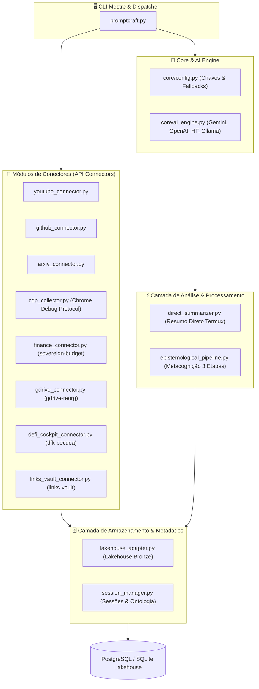

# 🚀 PLANO DE UPGRADE INTEGRADO — PROMPTCRAFT v2.0
> **Repositórios Unificados:** `promptcraft` · `sovereign-budget` · `gdrive-reorg` · `dfk-pecdoa-postman-cockpit` · `links-vault` · `lakehouse`  
> *Modularização de APIs, Coleta Autenticada via CDP, Resumos Concisos no Termux e Persistência de Objetos com Metadados*

---

## 🧭 0. Racional & Problema Resolvido

### 0.1. A Necessidade de Simplificação e Desativação do Monolito
*   **Problema Diagnostado:** O script original `promptcraft.py` havia crescido para mais de 2.100 linhas em um único arquivo monolítico. Ao tentar rodar no **Termux (Android)** para obter um resumo rápido de vídeo do YouTube, a resposta gerada vinha carregada de sobrecarga epistemológica (diff semântico, axiomas, meta-prompts), além de dificultar a manutenção do código.
*   **Solução Arquitetural:** Segmentação em módulos Python limpos e altamente comentados. Separação explícita entre **Síntese Direta (1-clique para Termux)** e o **Pipeline Metacognitivo Avançado (Desconstrutor, Tecelão, Refatorador)**.

---

## 🏗️ 1. Arquitetura Modular Segmentada



---

## 🔌 2. Integração das APIs dos Repositórios do Compilatorum

### 💰 2.1. Repositório `sovereign-budget` (Ingestão Financeira & Liquidez)
*   **Conector:** `connectors/finance_connector.py`
*   **APIs e Fontes:**
    *   Parser nativo de extratos bancários **OFX** (sem dependências de terceiros).
    *   Conversor de relatórios de cartão de crédito e extratos em **CSV/PDF**.
    *   Mapeador para partida dobrada no **Beancount** (`Assets:BRL:Checking`, `Expenses:Survival`).
*   **Cálculo de Métricas de Fluxo:**
    *   **VRC (Velocidade de Retenção de Capital):** Rastreio temporal da permanência de caixa.
    *   **TCR (Taxa de Conversão de Renda):** Proporção entre yields passivos (DeFi/CDB) e renda salarial ativa.
    *   **Buffer de Liquidez 15d:** Verificação em tempo real do saldo em Conta Corrente versus o custo mensal de existência.

### ☁️ 2.2. Repositório `gdrive-reorg` (Indexação de Armazenamento em Nuvem)
*   **Conector:** `connectors/gdrive_connector.py`
*   **APIs e Fontes:**
    *   Parser do inventário completo do **rclone** (`inventory_full.json`).
    *   Indexador de arquivos com metadados (MIME type, hash, mod_time, id do drive).
    *   Sincronizador incremental com tabelas relacionais e REST API do **Supabase**.

### 🎮 2.3. Repositório `dfk-pecdoa-postman-cockpit` (Telemetria DeFi & Cockpit Web3)
*   **Conector:** `connectors/defi_cockpit_connector.py`
*   **APIs e Fontes:**
    *   **CoinGecko API:** Cotações em BRL e USD para JEWEL, ONE e stablecoins.
    *   **DeFi Llama API:** Monitoramento de APY e TVL de pools de liquidez.
    *   **CryptoPanic API:** Métricas de sentimento de mercado e notícias.
    *   **The Graph / Covalent API:** Saldo on-chain de carteiras Web3.
    *   **Score de Oportunidade:** Algoritmo adaptativo para cálculo de risco/retorno de rendimentos.

### 🔖 2.4. Repositório `links-vault` (Cofre de Links & Favoritos)
*   **Conector:** `connectors/links_vault_connector.py`
*   **APIs e Fontes:**
    *   Parser de favoritos exportados em **Netscape HTML** (Chrome, Safari, Firefox).
    *   Extrator de URLs em arquivos `.md` e `.txt` com desduplicação por hash de URL.
    *   Integração com **Archive.org / Semiosis Protocol** para preservação digital de weblinks de alta relevância.

---

## 🌐 3. Coleta de Dados via Chrome DevTools Protocol (CDP)

*   **Conector:** `connectors/cdp_collector.py`
*   **Racional:** Acesso e raspagem de dados em sites autenticados (dashboards protegidos por login, portais corporativos ou feeds dinâmicos com JavaScript).
*   **Modo de Operação:**
    1.  Conexão via WebSocket / HTTP Remote Debugging na porta `9222` do Chromium/Chrome.
    2.  Leitura do DOM totalmente renderizado pós-execução de scripts da página.
    3.  Aproveitamento de cookies de sessão ativos do navegador do usuário sem expor credenciais em texto puro.

---

## 🗄️ 4. Compatibilidade e Ingestão com o Repositório `lakehouse`

*   **Adaptador de Armazenamento:** `storage/lakehouse_adapter.py`
*   **Estrutura de Persistência na Camada Bronze:**
    *   **PostgreSQL** (via `LAKEHOUSE_POSTGRES_DSN`) ou **SQLite local** (`lakehouse_local.db`).
*   **Esquema de Metadados Ricos (Metadata First):**
    ```json
    {
      "id": 1,
      "source": "https://www.youtube.com/watch?v=EXAMPLE",
      "source_type": "video",
      "volatility_score": 5,
      "checksum": "e3b0c44298fc1c149afbf4c8996fb92427ae41e4649b934ca495991b7852b855",
      "domain": "youtube_media",
      "raw_data": { "video_id": "EXAMPLE", "transcript_length": 14200 },
      "raw_text": "Texto completo da transcrição...",
      "metadata": {
        "ingested_by": "PromptCraft-Upgrade-Pipeline",
        "timestamp_utc": "2026-07-19T23:15:00Z",
        "summary": "Resumo executivo em bullet points..."
      }
    }
    ```
*   **Classificação Ontológica de Volatilidade (`volatility_score`):**
    *   `video`: 5 | `document`: 2 | `code`: 8 | `feed`: 9 | `data`: 10 | `personal`: 6 | `bookmark`: 4 | `gdrive`: 3

---

## 📋 5. Guia de Uso dos Subcomandos Atualizados (PromptCraft CLI v2.0)

### 📹 5.1. Transcrição e Resumo Direto de Vídeo (Termux)
```bash
# Resumo rápido em 1-clique no Termux
python3 promptcraft.py youtube "https://www.youtube.com/watch?v=CÓDIGO_VÍDEO"

# Resumo salvando metadados no Lakehouse
python3 promptcraft.py youtube "https://youtu.be/CÓDIGO_VÍDEO" --save-lakehouse
```

### 🌐 5.2. Coleta de Dados de Páginas Autenticadas (CDP)
```bash
# Inicie o Chrome com debugging remoto:
# google-chrome --remote-debugging-port=9222

python3 promptcraft.py cdp "https://painel-autenticado.com/relatorio" --save-lakehouse
```

### 📊 5.3. Métricas Financeiras e Orçamento (sovereign-budget)
```bash
python3 promptcraft.py finance --file extrato_banco.ofx --cc-balance 3500 --save-lakehouse
```

### ☁️ 5.4. Inventários do Google Drive (gdrive-reorg)
```bash
python3 promptcraft.py gdrive --inventory /home/sukata/inventory_full.json --save-lakehouse
```

### 🎮 5.5. Telemetria DeFi & Cockpit (dfk-pecdoa)
```bash
python3 promptcraft.py defi --wallet 0x71FD508B16d0f442f4Ae44A458259d254058A966 --save-lakehouse
```

### 🔖 5.6. Importação e Cofre de Favoritos (links-vault)
```bash
python3 promptcraft.py bookmarks /caminho/para/favoritos.html --save-lakehouse
```

---

## ✅ 6. Checklist de Implementação Realizada

- [x] **Segmentação do Código Monolítico**: `promptcraft.py` refatorado e dividido nas pastas `core/`, `connectors/`, `storage/` e `analysis/`.
- [x] **Código Abundantemente Comentado**: Todos os arquivos possuem docstrings descritivas em português e explicações linha por linha.
- [x] **Resumo Conciso para Termux**: Módulo `analysis/direct_summarizer.py` implementado para respostas rápidas sem meta-prompts pesados.
- [x] **Conector CDP**: Módulo `connectors/cdp_collector.py` criado para scraping autenticado via Chrome Debug Protocol.
- [x] **Integração sovereign-budget**: `connectors/finance_connector.py` com parser OFX e métricas VRC/TCR.
- [x] **Integração gdrive-reorg**: `connectors/gdrive_connector.py` com leitor de inventário rclone e agrupamento por MIME.
- [x] **Integração dfk-pecdoa-postman-cockpit**: `connectors/defi_cockpit_connector.py` agregando CoinGecko e DeFi Llama.
- [x] **Integração links-vault**: `connectors/links_vault_connector.py` para parse de favoritos Netscape HTML e extração de links.
- [x] **Compatibilidade Lakehouse**: `storage/lakehouse_adapter.py` gravando objetos com checksum SHA-256 e metadados estruturados em PostgreSQL / SQLite.
